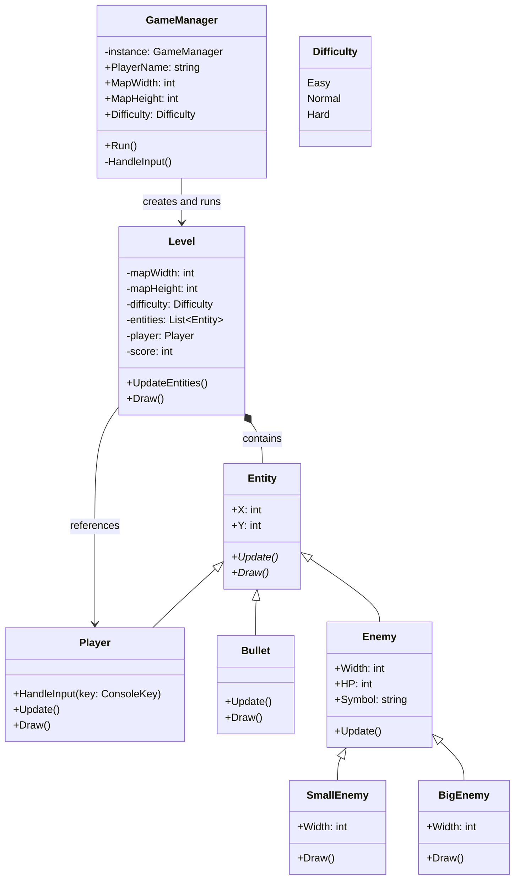

```mermaid
classDiagram
    class GameManager {
        -instance: GameManager
        +PlayerName: string
        +MapWidth: int
        +MapHeight: int
        +Difficulty: Difficulty
        +Run()
        -HandleInput()
    }

    class Level {
        -mapWidth: int
        -mapHeight: int
        -difficulty: Difficulty
        -entities: List~Entity~
        -player: Player
        -score: int
        +UpdateEntities()
        +Draw()
    }

    class Entity {
        +X: int
        +Y: int
        +Update()*
        +Draw()*
    }

    class Player {
        +HandleInput(key: ConsoleKey)
        +Update()
        +Draw()
    }

    class Bullet {
        +Update()
        +Draw()
    }

    class Enemy {
        +Width: int
        +HP: int
        +Symbol: string
        +Update()
    }

    class SmallEnemy {
        +Width: int
        +Draw()
    }

    class BigEnemy {
        +Width: int
        +Draw()
    }


    class Difficulty {
        Easy
        Normal
        Hard
    }

    GameManager --> Level : creates and runs

    Level *-- Entity : contains
    Level --> Player : references

    Entity <|-- Player
    Entity <|-- Bullet
    Entity <|-- Enemy

    Enemy <|-- SmallEnemy
    Enemy <|-- BigEnemy

```
